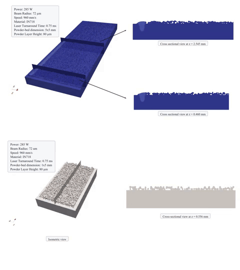

# LPBF Melt Pool Dynamics — Simulation Code

[](https://arxiv.org/abs/2604.07359)
[](https://www.gnu.org/licenses/gpl-3.0)

This repository contains the OpenFOAM-10 solver and simulation cases used in:

> **Laser Powder Bed Fusion Melt Pool Dynamics for Different Geometric Variations
> and Powder Layer Heights: High-Fidelity Multiphysics Modeling vs 2025 NIST
> Experiments**
> Badhon Kumar, Rakibul Islam Kanak, Nishat Sultana, Jiachen Guo, Andrew
> Schrader, Wing Kam Liu, Abdullah Al Amin<sup>†</sup>.
> arXiv:[2604.07359](https://arxiv.org/abs/2604.07359).
>
> <sup>†</sup> Corresponding author.

The code is a fork of the [`laserbeamFoam`](https://github.com/micmog/LaserbeamFoam)
solver suite, built against **OpenFOAM-10**, extended to reproduce the NIST
AM-Bench 2025 laser powder bed fusion pad experiments studied in the paper.



*Top: `ch_5x5` (5 mm × 5 mm pad). Bottom: `ch_1x5` (1 mm × 5 mm pad). Both with an 80 µm powder layer.*

## What `laserbeamFoam` does

`laserbeamFoam` is a volume-of-fluid (VOF) solver for high energy density
laser–material interaction (welding, drilling, powder bed fusion). It treats the
metallic substrate and the shielding gas as two incompressible phases and
captures:

- fusion/melting state transition with latent heat,
- surface tension and its temperature dependence (Marangoni flow),
- a phenomenological recoil pressure for vaporisation,
- buoyancy (Boussinesq) and momentum damping in the solidifying mush.

The heat source is a **ray-tracing** model: the incident Gaussian beam is
discretised into rays that are tracked through the domain, depositing energy at
each surface reflection via the Fresnel equations.

## About this study

The paper studies how **powder layer height** (bare plate, 80 µm, 160 µm) and
**pad geometry** affect melt pool dynamics in laser powder bed fusion, and
compares the predicted melt pool metrics (depth, width, solidified and dilution
areas) against the NIST AM-Bench 2025 experiments.

The cases here target the NIST **CHAL-AMB2025-06-PMPG** challenge (Pad Melt Pool
Geometry): arrays of overlapping laser tracks ("pads") on IN718, measuring
per-track bead height, depth, width, overlap, and solidified / dilution areas.

The full NIST pad is 45 tracks over a 5 mm width. **These cases use at most 15
tracks** — the ray-tracing VOF solver is very expensive, so the reduced pads are
run on an HPC cluster to keep cost manageable while reproducing the AM-Bench
process conditions:

| Parameter | Value |
|---|---|
| Laser power | 285 W |
| Scan speed | 960 mm/s |
| Hatch spacing | 0.11 mm |
| Beam radius (Gaussian) | 36 µm |
| Incidence angle | 5° (`V_incident = (0.087 0.996 0)`) |
| Track turnaround | 0.75 ms |
| Material | IN718 |

Beyond the upstream solver, this fork adds per-step **melt tracking** fields
(`condition`, `meltHistory`, `meltTrackID`) and reads a per-track duration from
`constant/trackProperties`; see [CLAUDE.md](CLAUDE.md) for details.

## Installation

You install **two things**: **OpenFOAM-10** (the CFD platform this code runs on)
and **this solver** (which you compile on top of OpenFOAM). OpenFOAM-10 comes
either from a normal install on your machine or from a ready-made container — you
only ever compile *this* solver.

**Which route should I use?**

- **Option A — Native:** you already have (or can install) OpenFOAM-10 on your
  own Linux machine.
- **Option B — Docker:** on a laptop/workstation and you don't want to install
  OpenFOAM yourself. **Easiest for beginners.**
- **Option C — Apptainer:** on an HPC cluster where Docker is not allowed.

Everything below assumes a Linux terminal and basic familiarity with `cd`.

### Step 0 — Get the code (all routes)

Clone this repository and move into it. **Every later command is run from inside
this folder.**

```bash
git clone https://github.com/alamin-research/multi-track-PBF-LB-M.git
cd multi-track-PBF-LB-M
```

### Step 1 — Install OpenMPI 5.0.7

All simulations in the paper were run and **tested with OpenMPI 5.0.7**. Install
it *before* building the solver so OpenFOAM links against the same MPI, and
because the tutorial `Allrun` / `job.sh` scripts expect it at
`~/opt/openmpi-5.0.7`. Build it from source:

```bash
cd /tmp
wget https://download.open-mpi.org/release/open-mpi/v5.0/openmpi-5.0.7.tar.gz
tar xf openmpi-5.0.7.tar.gz
cd openmpi-5.0.7
./configure --prefix=$HOME/opt/openmpi-5.0.7
make -j$(nproc)
make install
```

Then add it to your environment (append to `~/.bashrc`, and `source ~/.bashrc`):

```bash
export PATH="$HOME/opt/openmpi-5.0.7/bin:$PATH"
export LD_LIBRARY_PATH="$HOME/opt/openmpi-5.0.7/lib:$LD_LIBRARY_PATH"
```

Check it works — this should report `5.0.7`:

```bash
mpirun --version
```

> **Container routes (B / C):** the OpenFOAM image already bundles an MPI, so this
> local build is mainly for the native route and to satisfy the MPI paths
> hard-coded in the tutorial run scripts. Adjust those paths if you rely on the
> container's MPI instead.

### Option A — Native OpenFOAM-10

1. **Install OpenFOAM-10** if you don't have it, following the official Ubuntu
   guide: <https://openfoam.org/download/10-ubuntu/>. (Skip this step if it's
   already installed.)
2. **Load the OpenFOAM environment.** This makes build commands like `wmake`
   available in your terminal:
   ```bash
   source /opt/openfoam10/etc/bashrc
   ```
   The path depends on where OpenFOAM was installed; the line above is the
   default for the Ubuntu package. Check it worked — this should print `10`:
   ```bash
   echo $WM_PROJECT_VERSION
   ```
3. **Build the solver** (from the repository folder). `-j` uses all CPU cores;
   the first build takes a few minutes:
   ```bash
   ./Allwmake -j
   ```
4. Later, `./Allwclean` removes the build if you want to start over.

### Option B — Docker (laptop / workstation)

Docker runs OpenFOAM-10 inside a container, so you never install OpenFOAM
yourself.

1. **Install Docker** (Docker Desktop or Docker Engine):
   <https://docs.docker.com/get-docker/>. Confirm it works:
   ```bash
   docker run hello-world
   ```
2. **Add this helper function** to the end of your `~/.bashrc`. It starts the
   OpenFOAM container with your home folder visible inside it:
   ```bash
   of10 () {
       local of10_home="$HOME/.of10-home"
       mkdir -p "$of10_home"
       docker rm -f of10 >/dev/null 2>&1
       docker run -it --name of10 --hostname of10 --user root \
           -e HOME="$of10_home" -e USER=root -e LOGNAME=root \
           -e FOAM_USER_APPBIN="$HOME/platforms/linux64GccDPInt32Opt/bin" \
           -e FOAM_USER_LIBBIN="$HOME/platforms/linux64GccDPInt32Opt/lib" \
           -v "$HOME":"$HOME" -w "$PWD" \
           openfoam/openfoam10-paraview510 bash
   }
   ```
3. **Reload your shell** so the new function is available:
   ```bash
   source ~/.bashrc
   ```
4. **Enter the container** from the repository folder:
   ```bash
   of10
   ```
   The first time, Docker downloads the image (a few GB) — this happens **once**.
   Your prompt changes, which means you are now *inside* the container, in the
   same folder.
5. **Load OpenFOAM and build** (these run inside the container):
   ```bash
   source /opt/openfoam10/etc/bashrc
   ./Allwmake -j
   ```
6. Type `exit` to leave the container. (`./Allwclean`, run inside the container,
   cleans the build.)

### Option C — Apptainer / Singularity (HPC cluster)

Clusters usually block Docker but provide Apptainer (formerly Singularity). You
build the OpenFOAM image once as a `.sif` file, then compile inside it.

1. **Load Apptainer** if your cluster uses environment modules (ask your admin;
   it's often):
   ```bash
   module load apptainer
   ```
2. **Build the image file** (one time, takes a few minutes):
   ```bash
   apptainer build ~/openfoam10.sif docker://openfoam/openfoam10-paraview510
   ```
3. **Add this helper function** to your `~/.bashrc` (replace `~/openfoam10.sif`
   if you saved the image elsewhere). It runs commands inside the image with
   OpenFOAM already loaded:
   ```bash
   of10 () {
       if [ "$#" -eq 0 ]; then
           apptainer exec --cleanenv --env USER="$USER" ~/openfoam10.sif \
               bash --noprofile --norc -lc "source /opt/openfoam10/etc/bashrc && exec bash --noprofile --norc -i"
       else
           apptainer exec --cleanenv --env USER="$USER" ~/openfoam10.sif \
               bash --noprofile --norc -lc "source /opt/openfoam10/etc/bashrc && $*"
       fi
   }
   ```
4. **Reload your shell:**
   ```bash
   source ~/.bashrc
   ```
5. **Build the solver** from the repository folder:
   ```bash
   of10 ./Allwmake -j
   ```
   (Or run `of10` on its own to get an interactive OpenFOAM shell, then
   `./Allwmake -j`.)

### Verify the build

In the **same environment you built in** (inside the container for Options B/C),
check the solver was created:

```bash
which laserbeamFoam
```

It should print a path ending in `.../bin/laserbeamFoam`. If it does, you're
done. If it says "not found", make sure you sourced the OpenFOAM environment
(`source /opt/openfoam10/etc/bashrc`) in the current terminal.

Compiled programs install to `$FOAM_USER_APPBIN`; libraries to
`$FOAM_USER_LIBBIN` / `$FOAM_LIBBIN`.

## Tutorial cases

Two representative cases live under `tutorials/`, one for each NIST AM-Bench pad
geometry. Both use an 80 µm powder layer on an IN718 plate and the base process
conditions above with a 0.75 ms track turnaround.

The paper covers six cases in total: the two pad geometries (5 mm × 5 mm and
1 mm × 5 mm), each at three powder layer thicknesses — bare plate, 80 µm, and
160 µm. The two cases provided here (both 80 µm) are examples; other conditions
are obtained by changing the powder layer in the case setup.

### `ch_5x5` — 5 mm × 5 mm pad

- Domain 1.94 × 5.14 × 0.5 mm, mesh 194 × 514 × 50 (~5.0 M cells, 10 µm).
- 15 serpentine tracks (of the 45 in the full pad), 4.84 mm laser-on per track.
- End time 86.88 ms.
- The powder layer and baseplate are seeded into `alpha.metal` by
  `setSolidFraction` from `constant/location`.

### `ch_1x5` — 1 mm × 5 mm pad

- Domain 1.84 × 1.14 × 0.6 mm, mesh 184 × 114 × 60 (~1.26 M cells, 10 µm).
- 15 serpentine tracks, end time 24.375 ms.
- The powder layer and baseplate are seeded into `alpha.metal` by
  `setSolidFraction` from `constant/location`.

### Running a case

Each case has an `Allrun` (prepare + solve) and an `Allclean` (reset) script:

```bash
cd tutorials/ch_5x5
./Allrun
```

`Allrun` performs, in order: copy `initial/` to `0/`, `blockMesh`,
`setSolidFraction`, `transformPoints` (rotates the mesh so the build axis aligns
with the laser), `decomposePar`, the parallel solve, `reconstructPar`, and
`foamToVTK`.

> **Note:** the `Allrun` scripts hard-code a local OpenMPI 5.0.7 and
> OpenFOAM-10 path and `mpirun -np 80`. Edit the MPI/OpenFOAM paths and the core
> count near the top/bottom of each `Allrun` to match your machine before
> running.

### Running on an HPC cluster (SLURM)

Each case also ships a `job.sh` SLURM batch script for cluster runs. It performs
the same setup and solve as `Allrun`, with two conveniences:

- **Restartable** — if `processor0/` already exists it skips meshing and
  decomposition and continues from the latest time, so a job stopped by the
  walltime limit can simply be resubmitted.
- **Auto post-processing** — once the run reaches `endTime` it runs
  `reconstructPar` and `foamToVTK` automatically.

Edit the `#SBATCH` directives (account, nodes/tasks, walltime, email) and the
OpenFOAM / MPI paths at the top to match your cluster, then submit:

```bash
cd tutorials/ch_5x5
sbatch job.sh
```

## Contact

For questions about the paper or this code, contact the corresponding author:

**Abdullah Al Amin** — Assistant Professor, Department of Mechanical and
Aerospace Engineering, University of Dayton
Email: <aamin1@udayton.edu>
Lab: [SMALT — Smart Manufacturing Advancement and Logistics Technology](http://smalt.dev/)

## License

`laserbeamFoam`, and by extension this fork, is licensed under the
[GNU General Public License version 3](https://www.gnu.org/licenses/gpl-3.0.en.html),
following OpenFOAM.

## Citing

If you use this code, please cite our paper:

```bibtex
@article{Kumar2026LPBFMeltPool,
  title   = {Laser Powder Bed Fusion Melt Pool Dynamics for Different Geometric
             Variations and Powder Layer Heights: High-Fidelity Multiphysics
             Modeling vs 2025 NIST Experiments},
  author  = {Kumar, Badhon and Kanak, Rakibul Islam and Sultana, Nishat and
             Guo, Jiachen and Schrader, Andrew and Liu, Wing Kam and
             Al Amin, Abdullah},
  journal = {arXiv preprint arXiv:2604.07359},
  year    = {2026},
  doi     = {10.48550/arXiv.2604.07359}
}
```

Please also cite the upstream `laserbeamFoam` solver:

```bibtex
@article{Flint2023laserbeamFoam,
  title   = {laserbeamFoam: Laser ray-tracing and thermally induced state
             transition simulation toolkit},
  author  = {Flint, T. F. and Robson, J. D. and Parivendhan, G. and Cardiff, P.},
  journal = {SoftwareX},
  volume  = {21},
  pages   = {101299},
  year    = {2023},
  doi     = {10.1016/j.softx.2022.101299}
}
```

## References

- Kumar, B., Kanak, R. I., Sultana, N., Guo, J., Schrader, A., Liu, W. K., &
  Al Amin, A. (2026). *Laser Powder Bed Fusion Melt Pool Dynamics for Different
  Geometric Variations and Powder Layer Heights: High-Fidelity Multiphysics
  Modeling vs 2025 NIST Experiments.* arXiv:2604.07359.
  https://arxiv.org/abs/2604.07359
- Flint, T. F., Robson, J. D., Parivendhan, G., & Cardiff, P. (2023).
  *laserbeamFoam: Laser ray-tracing and thermally induced state transition
  simulation toolkit.* SoftwareX, 21, 101299.
  https://doi.org/10.1016/j.softx.2022.101299
- Parivendhan, G., Cardiff, P., Flint, T., et al. (2023). *A numerical study of
  processing parameters and their effect on the melt-track profile in Laser
  Powder Bed Fusion processes.* Additive Manufacturing, 67, 103482.
  https://doi.org/10.1016/j.addma.2023.103482
- NIST AM-Bench 2025. *AMB2025-06 and AMB2025-07 Benchmark Measurements and
  Challenge Problems.* Calibration dataset: https://doi.org/10.18434/mds2-3707
- Deisenroth, D., Mekhontsev, S., & Grantham, S. (2025). *Design and Calibration
  of the Fundamentals of Laser-Material Interaction (FLaMI) Powder Bed Fusion
  Testbed at NIST.* NIST AMS 100-66. https://doi.org/10.6028/NIST.AMS.100-66

## Acknowledgement

This offering is not approved or endorsed by OpenCFD Limited, producer and
distributor of the OpenFOAM software, and owner of the OPENFOAM® and OpenCFD®
trade marks. OPENFOAM® is a registered trademark of OpenCFD Limited.
